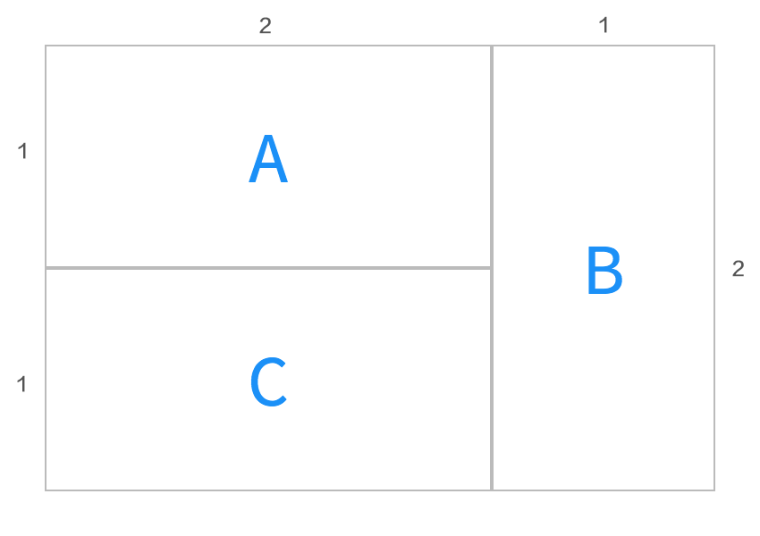
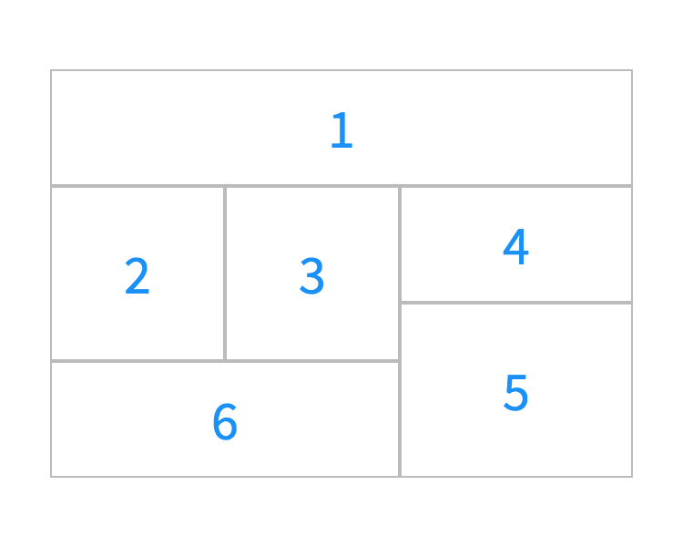
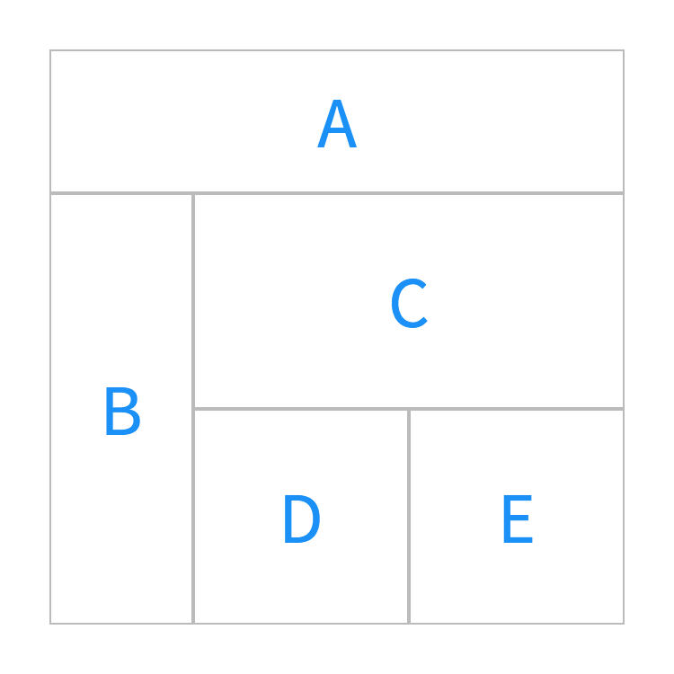
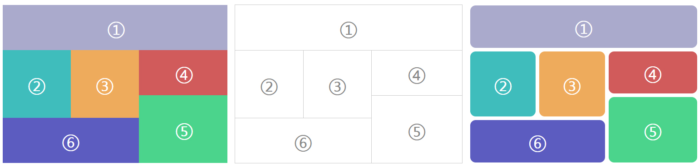
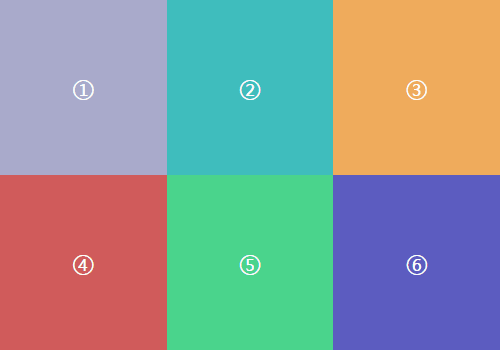
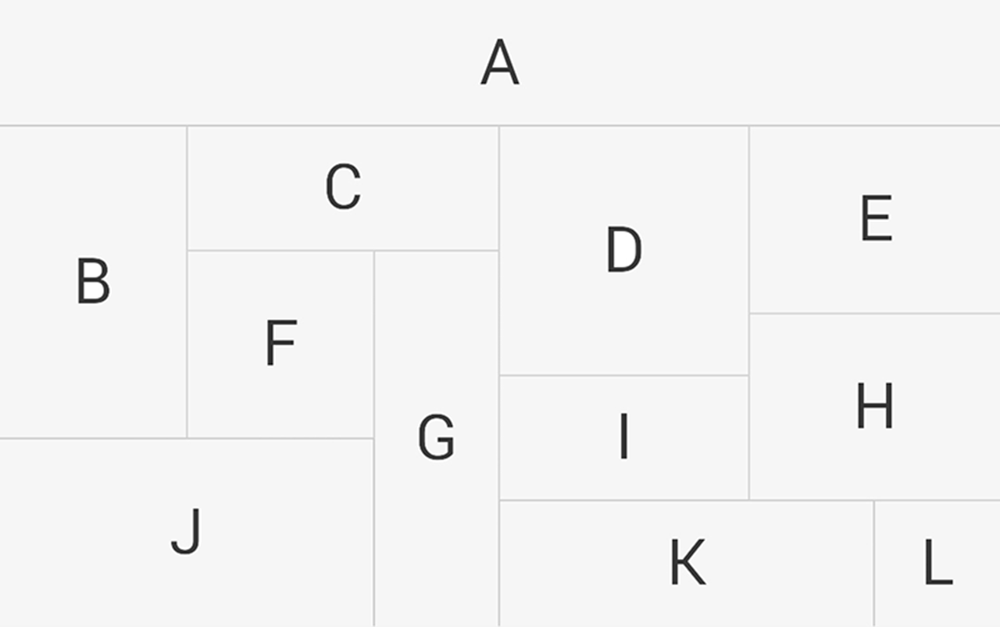
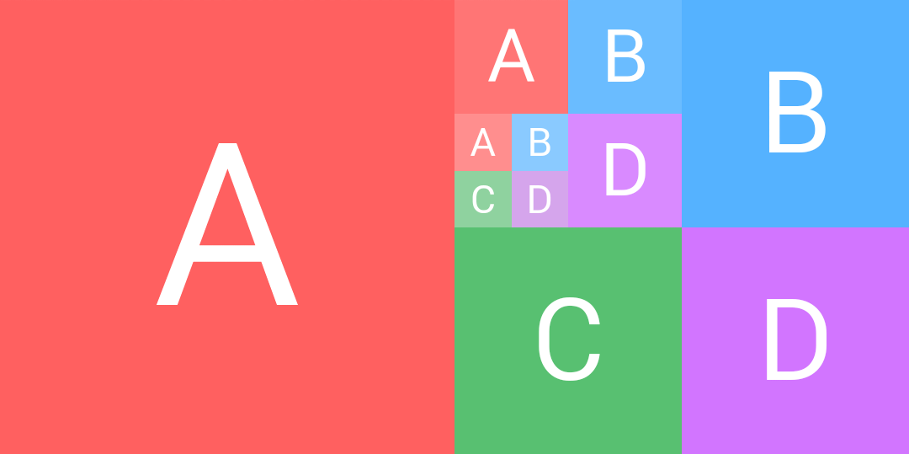

# 网格式布局组件

一个网格式布局组件，基于 Vue 2.0 实现，兼容 Weex 平台。

> CSS 里已经有了[网格布局](https://www.w3.org/TR/css-grid-1/)的规范，但是学习难度很大，有一二十个属性。而且 CSS 语法的表达能力有限，描述这种复杂布局，的确有点难为它了。

因为和 grid 规范不一样，所以暂且将组件命名成 mesh。

## 实现目标

+ 能够方便的写复杂布局，借鉴了 CSS Grid 布局规范。
+ 减少标签的嵌套层次，能够优化移动端的渲染性能。
+ 不依赖 CSS 实现，没有 CSS 的解析负担。

## 布局效果

如果想实现如下布局效果：



用 CSS 写是这样的（[CodePen](http://codepen.io/Hanks10100/pen/ggjKzY)）：

```html
<div class="container">
  <div class="a">A</div>
  <div class="b">B</div>
  <div class="c">C</div>
</div>

<style>
/* 仅保留了 grid 相关的样式 */
.container {
  display: grid;
  width: 300px;
  grid-template-columns: 100px 100px 100px;
  grid-template-rows: 100px 100px;
}
.a {
  grid-column: 1 / 3;
  grid-row: 1;
}
.b {
  grid-column: 3;
  grid-row: 1 / 3;
}
.c {
  grid-column: 1 / 3;
  grid-row: 2 ;
}
</style>
```

如果使用 `<mesh>` 组件写是这样的：

```html
<mesh width="300" column="3" layout="2,1|1,2|2,1">
  <div>A</div>
  <div>B</div>
  <div>C</div>
</mesh>
```

如果能把它转换成 CSS 的话，可以写成（自创语法，用来做对比，没有浏览器兼容）：

```CSS
.container {
  width: 300px;
  mesh-column: 3;
  mesh-layout: "2,1|1,2|2,1";
}
```

## 使用方法

代码封装成了 [Vue 插件](https://vuejs.org/v2/guide/plugins.html)，使用 `Vue.use` 安装（在浏览器环境中会自动安装）。

```js
import mesh from 'weex-component-mesh'
Vue.use(mesh)
```

安装之后会在全局注册 `<mesh>` 组件，和正常 Vue 组件一样使用即可。

### 组件属性

#### width

网格的宽度，接受字符串或者数字，不需要带单位，默认是 750px。

#### column

网格列数，默认是 12。

#### gap

网格组件之间的间距，默认是 0。

#### layout

描述网格布局，必选，字符串或者二维数组。

如果是字符串，则使用 `|` 分割组件，用 `,` 分割组件的宽高。如 `"2,1|1,2|2,1"` 表示有三个格子，第一个格子的宽是 2，高是 1；第二个格子的宽是 1，高是 2；第三个格子的宽是 2，高是 1。

分割符之间可以有任意空格，`"2,1|1,2|2,1"` 和 `"2, 1 | 1, 2 | 2, 1"` 等价。

二维数组 `[[2,1],[1,2],[2,1]]` 和字符串 `"2,1|1,2|2,1"` 等价。

##### 组件顺序

组件遵循 **“最靠上且最靠左”** 的原则排列，排列顺序参考下图。

`column = 12` `layout = "10,2 | 3,3 | 3,3 | 4,2 | 4,3 | 6,2"`：



### 组件嵌套

mesh 组件支持嵌套：

```html
<mesh width="640" column="4" layout="4,1|1,3|3,3">
  <div>A</div>
  <div>B</div>
  <mesh column="2" layout="2,1|1,1|1,1">
    <div>C</div>
    <div>D</div>
    <div>E</div>
  </mesh>
</mesh>
```

效果如下图：



## 更多布局效果









参考 [examples](./examples/) 目录下的例子。

## 注意事项

+ 要确保网格能够被填满，而且不存在重叠部分。
